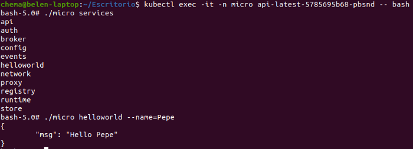
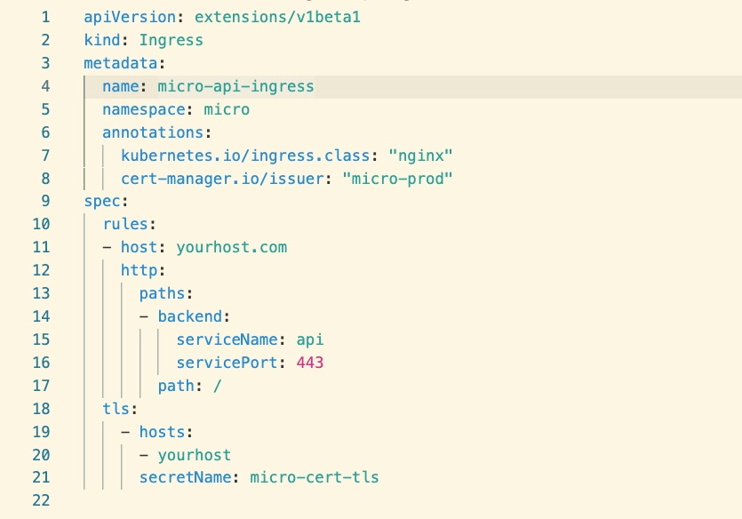

#  Go Micro on Kubernetes: Getting started


https://itnext.io/go-micro-on-kubernetes-getting-started-2959dd6c2d4f     


##  1. Installing Micro in our K8S cluster

```
kubectl apply -f micro-setup.yaml
```
## 2. Building the “hello world” microservice
https://github.com/micro/services/tree/master/helloworld


```
git clone https://github.com/micro/services.git
```
## 3. Deployment in Kubernetes


```
kubectl apply -f deploy-helloworld.yaml
```
## 4.Testing from the CLI




## 5.Access via API with Ingress





